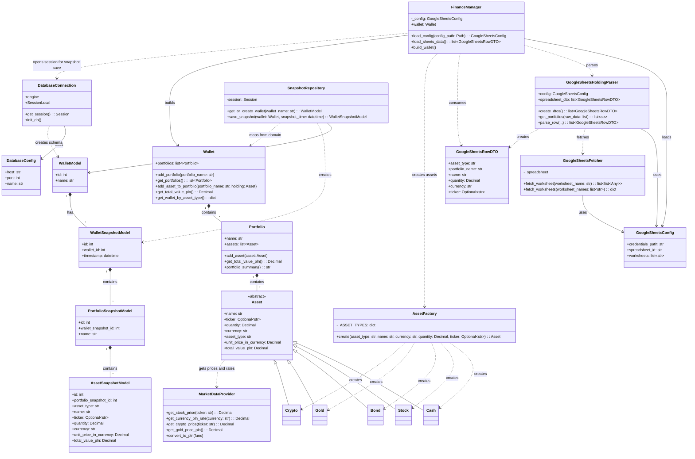
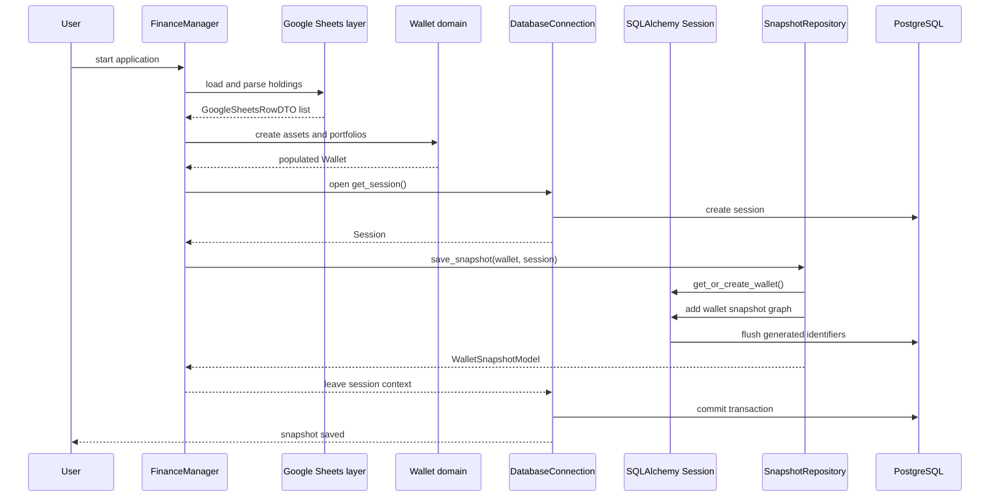

## Persistence and snapshot flow

The database layer is responsible for storing immutable, point-in-time views of the
domain wallet. It does not replace the domain models used to calculate values. The
mapping is one-way: `SnapshotRepository` reads the current `Wallet` aggregate and
creates a `WalletSnapshotModel` with nested `PortfolioSnapshotModel` and
`AssetSnapshotModel` records.

`DatabaseConnection` builds the SQLAlchemy engine from `DatabaseConfig`, creates the
database schema, and exposes a session context. The session context is the transaction
boundary: successful work is committed, an exception rolls the transaction back, and
the session is closed in either case. `SnapshotRepository` receives that session and
does not create its own connection.

The command-line flow is:

When `--skip_database_save` is supplied, the application still loads the holdings
and builds the in-memory wallet, but it does not create a database connection or
persist a snapshot.

