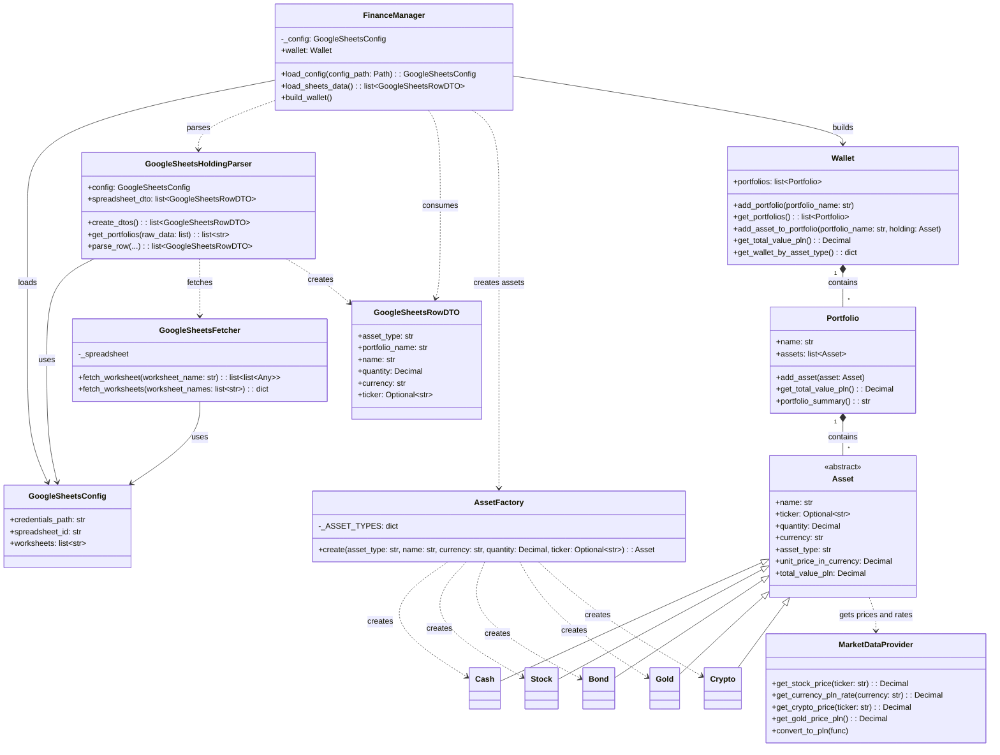

```mermaid
classDiagram

    %% Domain Models
    class Wallet {
        +portfolios: list~Portfolio~
        +add_portfolio(portfolio_name: str)
        +get_portfolios(): list~Portfolio~
        +add_asset_to_portfolio(portfolio_name: str, holding: Asset)
        +get_total_value_pln(): Decimal
        +get_wallet_by_asset_type(): dict
    }

    class Portfolio {
        +name: str
        +assets: list~Asset~
        +add_asset(asset: Asset)
        +get_total_value_pln(): Decimal
        +portfolio_summary(): str
    }

    class Asset {
        <<abstract>>
        +name: str
        +ticker: Optional~str~
        +quantity: Decimal
        +currency: str
        +asset_type: str
        +unit_price_in_currency: Decimal
        +total_value_pln: Decimal
    }

    class Cash
    class Stock
    class Bond
    class Gold
    class Crypto

    class AssetFactory {
        -_ASSET_TYPES: dict
        +create(asset_type: str, name: str, currency: str, quantity: Decimal, ticker: Optional~str~): Asset
    }

    Asset <|-- Cash
    Asset <|-- Stock
    Asset <|-- Bond
    Asset <|-- Gold
    Asset <|-- Crypto
    AssetFactory ..> Cash : creates
    AssetFactory ..> Stock : creates
    AssetFactory ..> Bond : creates
    AssetFactory ..> Gold : creates
    AssetFactory ..> Crypto : creates

    %% Google Sheets Layer
    class GoogleSheetsConfig {
        +credentials_path: str
        +spreadsheet_id: str
        +worksheets: list~str~
    }

    class GoogleSheetsFetcher {
        -_spreadsheet
        +fetch_worksheet(worksheet_name: str): list~list~Any~~
        +fetch_worksheets(worksheet_names: list~str~): dict
    }

    class GoogleSheetsRowDTO {
        +asset_type: str
        +portfolio_name: str
        +name: str
        +quantity: Decimal
        +currency: str
        +ticker: Optional~str~
    }

    class GoogleSheetsHoldingParser {
        +config: GoogleSheetsConfig
        +spreadsheet_dto: list~GoogleSheetsRowDTO~
        +create_dtos(): list~GoogleSheetsRowDTO~
        +get_portfolios(raw_data: list): list~str~
        +parse_row(...): list~GoogleSheetsRowDTO~
    }

    GoogleSheetsFetcher --> GoogleSheetsConfig : uses
    GoogleSheetsHoldingParser --> GoogleSheetsConfig : uses
    GoogleSheetsHoldingParser ..> GoogleSheetsFetcher : fetches
    GoogleSheetsHoldingParser ..> GoogleSheetsRowDTO : creates

    %% Market Data Layer
    class MarketDataProvider {
        +get_stock_price(ticker: str): Decimal
        +get_currency_pln_rate(currency: str): Decimal
        +get_crypto_price(ticker: str): Decimal
        +get_gold_price_pln(): Decimal
        +convert_to_pln(func)
    }

    Asset ..> MarketDataProvider : gets prices and rates

    %% Orchestration
    class FinanceManager {
        -_config: GoogleSheetsConfig
        +wallet: Wallet
        +load_config(config_path: Path): GoogleSheetsConfig
        +load_sheets_data(): list~GoogleSheetsRowDTO~
        +build_wallet()
    }

    FinanceManager --> GoogleSheetsConfig : loads
    FinanceManager ..> GoogleSheetsHoldingParser : parses
    FinanceManager ..> GoogleSheetsRowDTO : consumes
    FinanceManager ..> AssetFactory : creates assets
    FinanceManager --> Wallet : builds

    %% Domain relationships
    Wallet "1" *-- "*" Portfolio : contains
    Portfolio "1" *-- "*" Asset : contains
    ```
```

