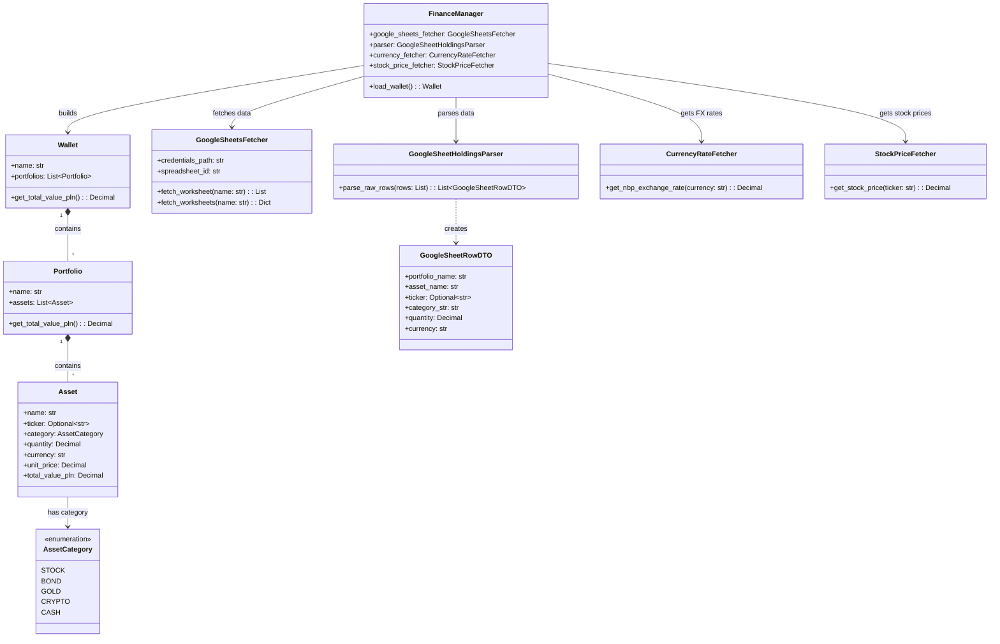

```mermaid
classDiagram

    %% Domain Models
    class Wallet {
        +name: str
        +portfolios: List~Portfolio~
        +get_total_value_pln(): Decimal
    }

    class Portfolio {
        +name: str
        +assets: List~Asset~
        +get_total_value_pln(): Decimal
    }

    class AssetCategory {
        <<enumeration>>
        STOCK
        BOND
        GOLD
        CRYPTO
        CASH
    }

    class Asset {
        +name: str
        +ticker: Optional~str~
        +category: AssetCategory
        +quantity: Decimal
        +currency: str
        +unit_price: Decimal
        +total_value_pln: Decimal
    }

    %% Google Sheets Layer
    class GoogleSheetsFetcher {
        +credentials_path: str
        +spreadsheet_id: str
        +fetch_worksheet(name: str): List
        +fetch_worksheets(name: str): Dict
    }

    class GoogleSheetRowDTO {
        +portfolio_name: str
        +asset_name: str
        +ticker: Optional~str~
        +category_str: str
        +quantity: Decimal
        +currency: str
    }

    class GoogleSheetHoldingsParser {
        +parse_raw_rows(rows: List): List~GoogleSheetRowDTO~
    }

    %% Market Data Layer
    class CurrencyRateFetcher {
        +get_nbp_exchange_rate(currency: str): Decimal
    }

    class StockPriceFetcher {
        +get_stock_price(ticker: str): Decimal
    }

    %% Orchestration
    class FinanceManager {
        +google_sheets_fetcher: GoogleSheetsFetcher
        +parser: GoogleSheetHoldingsParser
        +currency_fetcher: CurrencyRateFetcher
        +stock_price_fetcher: StockPriceFetcher
        +load_wallet(): Wallet
    }

    %% Domain relationships
    Wallet "1" *-- "*" Portfolio : contains
    Portfolio "1" *-- "*" Asset : contains
    Asset --> AssetCategory : has category

    %% Google Sheets relationships
    GoogleSheetHoldingsParser ..> GoogleSheetRowDTO : creates

    %% Orchestration relationships
    FinanceManager --> GoogleSheetsFetcher : fetches data
    FinanceManager --> GoogleSheetHoldingsParser : parses data
    FinanceManager --> CurrencyRateFetcher : gets FX rates
    FinanceManager --> StockPriceFetcher : gets stock prices
    FinanceManager --> Wallet : builds
    ```
```

