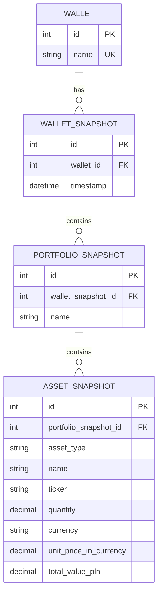

```mermaid
erDiagram
    WALLET ||--o{ WALLET_SNAPSHOT : has
    WALLET_SNAPSHOT ||--o{ PORTFOLIO_SNAPSHOT : contains
    PORTFOLIO_SNAPSHOT ||--o{ ASSET_SNAPSHOT : contains

    WALLET {
        int id PK
        string name UK
    }

    WALLET_SNAPSHOT {
        int id PK
        int wallet_id FK
        datetime timestamp
    }

    PORTFOLIO_SNAPSHOT {
        int id PK
        int wallet_snapshot_id FK
        string name
    }

    ASSET_SNAPSHOT {
        int id PK
        int portfolio_snapshot_id FK
        string asset_type
        string name
        string ticker
        decimal quantity
        string currency
        decimal unit_price_in_currency
        decimal total_value_pln
    }
```